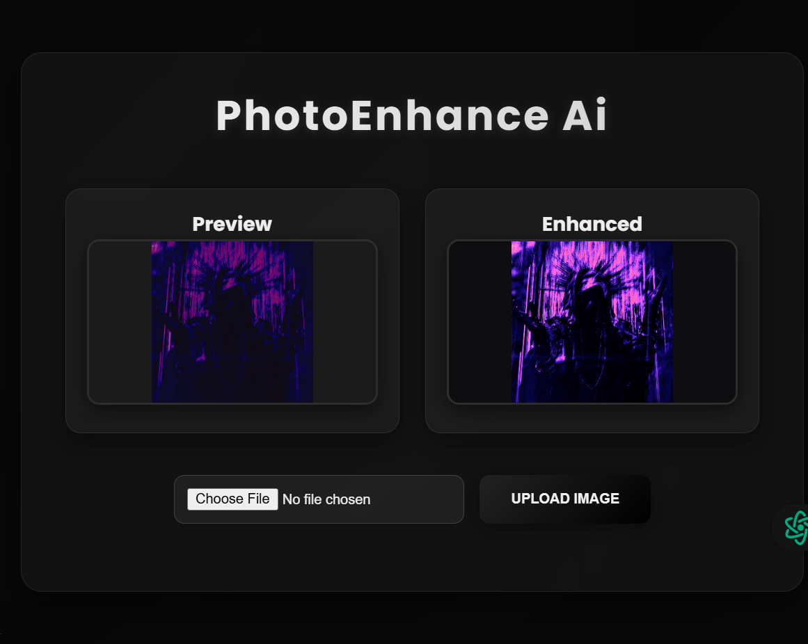

# PhotoEnhance Ai

PhotoEnhance Ai is a web-based image enhancement tool built with **Node.js, Express, MongoDB, and EJS**. It allows users to upload images, enhance them using AI or sharp-based processing, and download the enhanced versions.

---

## Features

- Upload images (supports large files up to 50MB)
- Enhance images using AI or sharp
- Download enhanced images
- Track uploaded and enhanced images
- Responsive frontend with EJS templates
- MongoDB Atlas integration for storing images
- Error handling with custom 404 page

---

## Tech Stack

- **Backend:** Node.js, Express.js
- **Database:** MongoDB Atlas
- **Frontend:** EJS, HTML, CSS
- **Image Processing:** Sharp, optional AI upscalers
- **Other:** dotenv for environment variables, CORS support

---

## Screenshots

### Homepage


---

## Getting Started

### Prerequisites

- Node.js (v18+ recommended)
- npm or yarn
- MongoDB Atlas account

### Installation

1. Clone the repository:

```bash
git clone https://github.com/adadarsh23/Enhance-Photo
cd Enhance-Photo
```
2. Install dependencies:

```bash
npm install
```
3. Create a .env file in the root directory and add:

```bash
PORT=3000
MONGO_URI=your_mongodb_connection_string
```

4. Start the server:
```bash
npm run dev
```

5. Open your browser and go to:
```bash
http://localhost:3000
```

### Project Structure
```bash
photoenhance-pro/
│
├─ controllers/       # Logic for image upload & enhancement
├─ models/            # MongoDB schemas
├─ routes/            # API routes
├─ views/             # EJS templates
├─ public/            # Static files (CSS, JS)
├─ .env               # Environment variables
├─ .gitignore
├─ package.json
└─ server.js

```

| Route                 | Method | Description           |
| --------------------- | ------ | --------------------- |
| `/api/images`         | POST   | Upload an image       |
| `/api/images/:id`     | GET    | Get a specific image  |
| `/api/images/enhance` | POST   | Enhance a given image |

### License
 This project is licensed under the MIT License.

### Contact
Created by Âd Adarsh.

